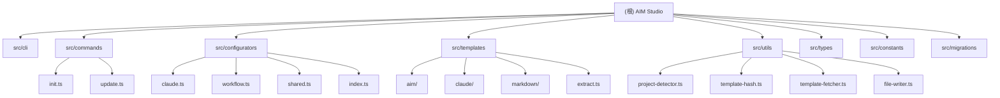

# AIM Studio 开发指南 (Developer Guide)

> 本文档面向 AIM Studio (CLI) 的开发者。

---

## 项目愿景

AIM Studio (原 Trellis) 是一个 AI 驱动的开发工作流 CLI 工具，致力于解决 AI 辅助开发中的核心痛点：
- **思考先于编码**：通过 Thinking Guides 和 Ralph Loop 避免"修 A 坏 B"的循环
- **上下文持久化**：通过 Spec Injection 将规则注入每个任务，而非依赖记忆
- **跨层思考**：通过 Cross-Layer Guide 梳理数据流和模块边界

---

## 架构总览



---

## 模块索引

| 模块路径 | 职责 | 入口文件 |
|----------|------|----------|
| `src/cli/` | CLI 入口、命令行解析 | `index.ts` |
| `src/commands/` | init/update 命令实现 | `init.ts`, `update.ts` |
| `src/configurators/` | AI 工具配置生成 | `claude.ts`, `workflow.ts` |
| `src/templates/` | 模板系统 (Python/Markdown) | `aim/index.ts`, `markdown/index.ts` |
| `src/utils/` | 工具函数 | `project-detector.ts`, `template-hash.ts` |
| `src/types/` | TypeScript 类型 | `ai-tools.ts`, `migration.ts` |
| `src/constants/` | 常量定义 | `version.ts`, `paths.ts` |
| `src/migrations/` | 版本迁移 | `index.ts` |

---

## 运行与开发

### 安装依赖

```bash
pnpm install
```

### 编译构建

```bash
# 编译 TS 并复制模板文件到 dist/
pnpm build
```

### 测试

```bash
# 运行所有测试
pnpm test

# 运行特定测试
pnpm test test/commands/init.integration.test.ts
```

### 本地调试

```bash
# 链接全局命令 'aim' 到本地构建
npm link
```

---

## 测试策略

- **Vitest**: 单元测试和集成测试
- **测试覆盖**: 核心命令 (init/update)、配置器、模板提取、版本比较等

---

## 编码规范

- **语言**: 代码注释和文档使用中文
- **提交信息**: 使用 Conventional Commits (feat, fix, docs, chore)
- **测试**: 新功能必须包含测试用例

---

## 发布流程

```bash
# 发布 Patch 版本 (0.x.1)
pnpm release

# 发布 Minor 版本 (0.x.0)
pnpm release:minor

# 发布 Beta 版本
pnpm release:beta
```

---

## 核心逻辑说明

### 1. 模板系统

AIM Studio 的核心在于"模板注入"。
- **Markdown 模板**: 位于 `src/templates/markdown/`，包含 Spec 定义
- **Python 脚本模板**: 位于 `src/templates/aim/scripts/`，负责任务管理
- **Claude 配置模板**: 位于 `src/templates/claude/`，包含 Agents 和 Hooks

### 2. Story Mode (漫剧创作模式)

通过以下方式实现：
1. **Project Type**: `src/utils/project-detector.ts` 识别 `story` 类型
2. **Spec Injection**: `src/configurators/workflow.ts` 将 `spec/story/` 模板写入用户项目
3. **Agent**: `.claude/agents/story.md` 定义漫剧主笔的人设

### 3. 哈希追踪 (Hash Tracking)

`src/utils/template-hash.ts` 实现模板修改追踪，用于：
- 检测用户是否修改过模板文件
- 在 update 时区分"自动更新"和"需要确认"

---

## 变更记录

| 日期 | 变更 |
|------|------|
| 2026-02-13 | AI 上下文初始化：Mermaid 结构图、模块索引表、覆盖率报告 |
| 2026-02-13 | 添加 Mermaid 结构图、模块索引表、覆盖率报告 |
| 2026-01 | 项目重构：从 Trellis 更名为 AIM Studio |
